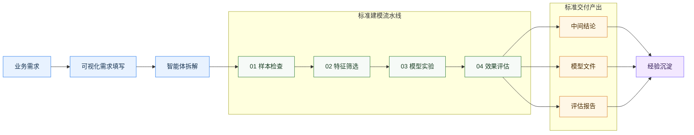
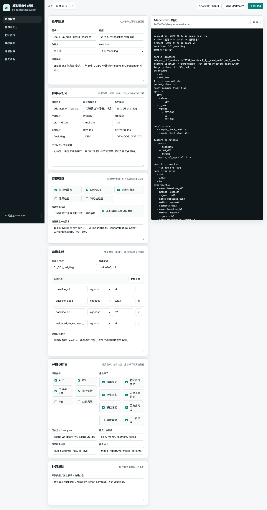

# 风险全场景建模工作台功能介绍

更新时间：2026-06-10 早晨修改版

## 1. 项目定位

本项目定位为风险全场景建模工作台，目标是把风险建模从分散脚本、人工口径沟通和手工报告整理，升级为一套标准化、可复用、可追溯、可扩展的团队级建模基础设施。

当前工作台已经围绕风险建模主流程形成可复用能力，包括需求结构化、样本检查、特征筛选、模型训练、评估对比、报告输出和产物审计。复借 G 卡是在风险主流程已跑通的基础上，进一步扩展到样本量更大、客群更复杂、经营属性更强的场景，用来验证工作台的泛化能力和规模化承接能力。

一句话概括：

> 工作台把“业务建模需求”转成“可执行的模型实验方案”，再把实验过程和结果沉淀成可复核、可交接、可复用的建模资产。

## 2. 工作台能力总览

工作台当前覆盖建模前、中、后的核心环节：

| 阶段 | 工作台能力 | 业务价值 |
| --- | --- | --- |
| 需求输入 | 可视化填写建模需求，导出结构化需求文档 | 降低使用门槛，减少反复沟通 |
| 需求理解 | Claude Code / Codex 将业务需求转成执行计划 | 把业务语言翻译成模型实验方案 |
| 样本检查 | 检查样本规模、标签分布、切分、客群结构 | 提前发现样本和口径问题 |
| 特征筛选 | 支持多表、高维特征、多阶段筛选 | 承接上万级候选字段收敛 |
| 模型训练 | 支持标准二分类训练和实验配置 | 快速形成可评估模型产物 |
| 模型评估 | AUC、KS、lift、PSI、月度、客群、版本对比 | 判断模型是否可用、哪里有效 |
| 报告交付 | 自动生成模型报告、模型卡、管理摘要 | 减少手工汇总和报告拼接 |
| 审计续跑 | 运行记录状态、产物登记、断点恢复、交接复盘 | 支撑长周期协作和复用 |

## 3. 可视化需求填写

用户入口是 HTML 需求生成器。用户不需要写代码，只需要在页面上填写建模目标、样本、标签、特征、实验、评估和报告要求，即可导出标准需求文档。

这一步的价值是把原本口头化、碎片化的建模需求，变成智能体和工作台可理解、可校验、可执行的结构化输入。

## 4. 模型需求结构化模板

工作台把模型需求拆成标准模块。不同风险场景只需要替换业务口径，不需要重新搭建建模流程。

| 模块 | 用户填写内容 | 工作台转化结果 |
| --- | --- | --- |
| 建模目标 | 预测逾期、复借、响应、回款、风险排序等 | 明确模型任务类型和实验方向 |
| 样本口径 | 人群范围、时间窗口、排除条件、业务状态 | 形成样本检查和切分方案 |
| 标签定义 | 目标字段、表现窗口、正负样本定义 | 形成标签校验和评估口径 |
| 特征来源 | 特征表、宽表、历史特征、禁用字段 | 形成特征筛选和数据准备方案 |
| 实验要求 | 基线模型、分群、加权、控过拟合、画像优化 | 形成模型实验清单 |
| 评估要求 | AUC、KS、lift、PSI、客群、月份、版本对比 | 形成标准评估报告 |
| 报告要求 | 模型报告、模型卡、管理摘要、业务切片 | 形成交付物清单 |

## 5. 业务需求到模型实验方案的适配

工作台不只是“跑模型”，更重要的是把业务诉求翻译成可尝试、可比较、可复盘的模型实验方案。后续会持续把高频实验模式沉淀为模板。

| 业务诉求 | 可转译的模型实验方案 |
| --- | --- |
| 画像优化 | 增加客群画像、行为特征、资产评级切片，验证不同人群的效果差异 |
| 控制过拟合 | 引入样本外和跨时间检验、特征稳定性筛选、模型复杂度控制、训练/验证差距观察 |
| 提升排序能力 | 增加十分箱 lift、高分段覆盖、分群 KS、排序倒挂检查 |
| 提升跨时间稳定性 | 增加月份切片、PSI、特征漂移检查和跨时间验证 |
| 支持分群经营 | 设计全客群模型、分客群模型、分客群加权模型等实验 |
| 解释模型变化 | 输出特征重要性、剔除明细、版本提升和分群贡献 |
| 支持策略落地 | 输出高/中/低分层、人群覆盖、风险交叉表和历史版本对比 |

例如，当业务提出“希望对某类人群画像做得更细，同时别让模型在跨时间样本上退化”，工作台可以转成一组实验：补充画像特征、设置稳定性筛选、增加样本外和跨时间验证、输出分群效果和 PSI。

## 6. 从风险主场景扩展到复杂经营样本

工作台已围绕风险建模主流程形成能力，适用于准入、授信、贷中、催收、反欺诈、模型换版等场景。

在此基础上，复借 G 卡用于验证更复杂的经营风险交叉场景：

- 样本量更大，当前评估样本达到 960 万级。
- 特征来源更多，候选字段达到 15,028 个，来自约 70 张特征表。
- 客群更复杂，包含老户、次新户、流失户等经营客群。
- 评估更复杂，需要同时看月份、客群、分箱、历史版本对比。
- 业务目标更复合，不只看风险，还要看意愿、排序和策略落地价值。

这说明工作台不是绑定单一 G 卡模型，而是风险主流程向大样本、复杂经营样本的扩展。

## 7. 已具备的核心功能

### 7.1 样本检查与画像

- 样本量、标签率、切分分布检查。
- 训练集、样本外、跨时间验证集对比。
- 客群、月份、资产评级等业务切片画像。
- 样本异常、标签异常和口径缺失识别。

### 7.2 大规模特征筛选

- 特征表清单和元数据管理。
- 分表预筛。
- 缺失率、稳定性、相关性筛选。
- 随机噪声重要性和空标签重要性筛选。
- 基线模型重要性筛选。
- 最终入模变量和剔除原因留痕。

### 7.3 模型实验与训练

- 支持标准二分类建模链路。
- 支持基线模型、分群、加权、特征方案对比等实验设计。
- 输出模型文件、训练指标、特征重要性、剔除明细和配置快照。
- 缺失真实数据时明确标记为占位结果，避免误当真实结果。

### 7.4 评估与版本对比

- 整体 AUC、KS、坏样本率。
- 月度稳定性和分数 PSI。
- 十分箱 lift 和排序能力。
- 分客群效果。
- 与历史模型、规则分或策略分的新旧版本对比。
- 意愿分层和风险表现交叉观察。

### 7.5 报告、审计与交接

- 自动生成模型报告、模型卡、管理摘要和缺失项说明。
- 所有关键产物登记到产物清单。
- 支持运行记录审计，区分真实产物、导入产物和占位结果。
- 支持 handoff、retrospective、lessons，降低交接成本。

## 8. 效率提升估算

以下为按历史手工建模流程估算的效率提升口径，后续可通过更多真实运行记录的执行统计持续校准。

| 环节 | 传统方式耗时 | 工作台方式耗时 | 预估节省 |
| --- | ---: | ---: | ---: |
| 需求整理和口径同步 | 1-2 天 | 0.5-1 天 | 约 50%-60% |
| 执行计划拆解 | 1 天 | 0.5 天 | 约 50% |
| 样本检查和记录 | 1-2 天 | 0.5-1 天 | 约 50%-60% |
| 特征筛选过程留痕 | 2-4 天 | 1-2 天 | 约 50%-60% |
| 模型训练和实验迭代 | 2-4 天 | 1-1.5 天 | 约 50%-60% |
| 指标汇总和切片分析 | 1-2 天 | 0.5-1 天 | 约 50%-70% |
| 报告初稿整理 | 2-4 天 | 1-1.5 天 | 约 50%-60% |
| 交接和复盘 | 1 天 | 0.5 天 | 约 50% |
| 全流程合计 | 11-21 天 | 5.5-9 天 | 约 50%-60% |

更重要的是，效率提升不只来自“跑得更快”，还来自减少重复沟通、减少人工复制错误、减少临时脚本维护、减少交接断层。

## 9. 当前能力边界

工作台当前定位是建模研发、评估和报告交付底座，不直接承担线上实时服务部署、策略系统发布、生产监控和回滚。

当前 G 卡运行记录是真实历史产物的标准化导入，不等同于本地端到端重跑证据。后续若要形成完整本地闭环，应创建新的运行记录，并按标准流程重新完成样本、特征、训练、评估和报告全链路。

涉及 MOB1/MOB3 等历史风险口径时，仍需要业务和数据同学确认观察窗口、分子分母和金额口径后才能作为正式指标使用。

## 10. 总结

本项目已经具备风险主流程建模工作台能力，并正在向复借 G 卡这类更复杂、更大样本、更经营化的场景扩展。它的核心价值是把业务需求转化为可执行模型实验，把模型过程沉淀为可审计产物，把一次性脚本工作升级为可复用的风险建模基础设施。
