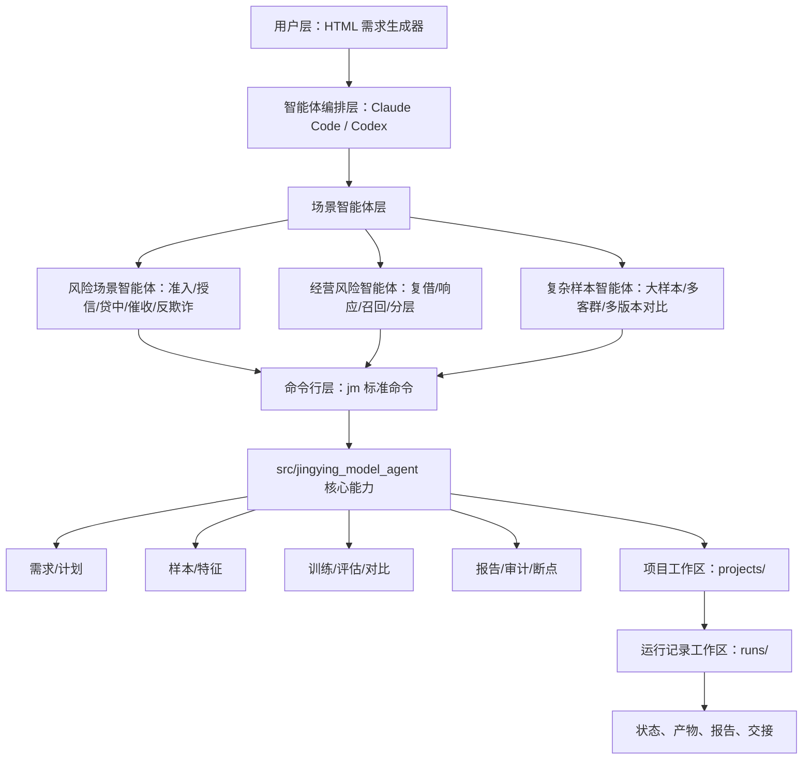

# 风险全场景建模工作台项目架构介绍

更新时间：2026-06-10 早晨修改版

## 1. 架构定位

本项目是面向风险全场景的本地建模工作台。整体架构围绕“可视化需求填写、场景智能体编排、标准命令行入口、核心建模能力、运行记录级断点续跑、产物审计”设计。

工作台已围绕风险主流程形成可复用能力，当前进一步扩展到复借 G 卡这种样本更复杂、量级更大、经营属性更强的场景，用于验证架构的泛化能力和规模化承接能力。

## 2. 总体架构



这个架构的核心是：场景差异由智能体和配置吸收，底层共用同一套命令行入口和建模能力。

## 3. 代码与目录结构

```text
jingying_model_agent/
├── tools/model_request_builder/        # 可视化建模需求填写页面
├── .agents/skills/                     # 智能体使用规则和场景协作能力
├── src/jingying_model_agent/           # 工作台核心能力
│   ├── request/                        # 需求解析和校验
│   ├── planning/                       # 执行计划生成
│   ├── scenario_agents/                # 风险、经营和复杂样本场景智能体规则沉淀
│   ├── project/                        # 项目创建和校验
│   ├── sample_check/                   # 样本检查
│   ├── feature_selection/              # 特征筛选和泄漏检查
│   ├── modeling/                       # 模型训练
│   ├── evaluation/                     # 效果评估和版本对比
│   ├── reporting/                      # 报告生成
│   ├── audit/                          # 产物登记和审计
│   └── project_state.py                # 项目断点和连续性状态
├── workflows/                          # 标准工作流定义
├── schemas/                            # 需求文档和执行计划结构约束
├── templates/project/                  # 新项目模板
├── tests/                              # 自动化测试
└── projects/                           # 具体建模项目
```

说明：风险场景智能体当前由 Claude Code / Codex、`.agents/skills/` 和 `jm` 命令行入口共同承接；`scenario_agents/` 表示后续将高频风险、经营和复杂样本场景规则进一步沉淀到 `src/jingying_model_agent/` 的可复用模块中。

## 4. 项目工作区结构

```text
projects/<project>/
├── project.yml                         # 项目基础配置和业务口径
├── project_state.yml                   # 项目级断点、目标、风险和下一步
├── configs/                            # 样本、特征、训练、评估、报告配置
├── requests/                           # 用户需求文档和执行计划
├── docs/                               # 项目说明、口径、流程、架构文档
├── data/                               # 本地数据、缓存和画像统计
├── queries/                            # SQL 模板和生成 SQL
├── runs/                               # 每次建模运行
├── handoffs/                           # 交接记录
└── retrospectives/                     # 复盘记录
```

业务口径、样本定义、标签定义、历史版本分数、风险表现窗口等放在项目层；通用能力放在 `src` 和命令行层，避免每个场景重复开发。

## 5. 运行记录结构与断点续跑

每次建模都创建独立 `run_id`。运行记录是断点续跑、审计和交接的核心单位。

```text
runs/<run_id>/
├── run_state.yml                       # 阶段状态和断点信息
├── audit/
│   ├── artifact_manifest.json          # 已登记产物清单
│   ├── command_log.jsonl               # 命令执行记录
│   └── decision_log.md                 # 关键决策记录
├── sample_check/                       # 样本检查产物
├── feature_selection/                  # 特征筛选产物
├── modeling_input/                     # 入模数据快照
├── modeling/                           # 模型和训练产物
├── evaluation/                         # 评估、分箱、PSI、版本对比
└── reports/                            # 模型报告、模型卡、管理摘要
```

断点续跑依赖三类文件：

| 文件 | 作用 |
| --- | --- |
| `project_state.yml` | 记录当前活跃运行记录、目标、下一步和风险 |
| `run_state.yml` | 记录每个阶段完成、待完成、导入证据或占位结果状态 |
| `artifact_manifest.json` | 记录产物路径、来源、阶段和校验信息 |

任务中断后，智能体可以根据这些文件判断从哪里继续，而不是重新跑全链路。

## 6. 工作台关键能力

| 能力 | 说明 |
| --- | --- |
| 可视化需求填写 | HTML 页面生成标准需求文档，降低使用门槛 |
| 场景智能体编排 | 将风险、经营、复杂样本需求翻译成模型实验方案 |
| 标准命令行入口 | `jm` 统一承接项目、运行记录、样本、特征、训练、评估、报告等动作 |
| 断点续跑 | 运行记录状态和产物清单支持中断后继续 |
| SQL 门禁 | 真实取数前必须先预览 SQL 并人工确认 |
| 特征筛选 | 支持多表、高维、稳定性、相关性、重要性筛选 |
| 模型实验 | 支持基线模型、分群、加权、控过拟合、画像优化等实验方向 |
| 效果评估 | 支持 AUC、KS、lift、PSI、月份、客群、版本对比 |
| 自动报告 | 从登记产物生成模型报告、模型卡、管理摘要 |
| 产物审计 | 区分真实产物、导入产物和占位结果，避免误用结果 |

## 7. 架构优势

| 优势 | 说明 |
| --- | --- |
| 易上手 | 用户通过 HTML 提需求，不需要理解底层命令 |
| 泛化强 | 风险主流程复用，场景差异通过智能体和配置吸收 |
| 可扩展 | 新业务场景可新增模板、配置和智能体规则 |
| 可追溯 | 每次运行记录保存需求、计划、产物、指标、报告和决策 |
| 可续跑 | 中断后根据状态文件和产物清单定位断点 |
| 可审计 | 报告基于登记产物，避免口径和证据不一致 |
| 省人力 | 减少重复脚本、指标整理、报告拼接和交接沟通 |

## 8. 当前扩展验证状态

风险主流程能力已经沉淀为工作台通用链路。当前复借 G 卡用于验证更复杂场景的承接能力，包括 960 万级样本、约 70 张特征表、15,028 个候选字段、多客群、多月份和多历史版本对比。

需要注意的是，当前活跃运行记录是历史真实产物的标准化导入，不是本地端到端重跑证据。它证明了工作台可以承接真实项目产物标准化、评估对比和报告生成；如需证明完整本地闭环，应创建新运行记录并按标准流程重新执行全链路。
