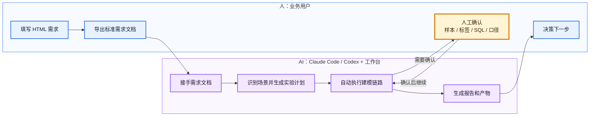

# 风险全场景建模工作台用户使用流程

更新时间：2026-06-10 早晨修改版

## 1. 核心原则

工作台的使用方式不是让用户自己跑复杂命令，而是让用户把建模需求说清楚，后续由 Claude Code / Codex 调用工作台完成建模链路。

用户主要做三件事：

1. 用 HTML 页面填写建模需求。
2. 在关键节点确认业务口径、标签定义和取数 SQL。
3. 查看模型报告和管理摘要，决定下一步。

中间的需求校验、计划生成、运行记录初始化、样本检查、特征筛选、模型训练、效果评估、版本对比、报告生成和交接记录，由 Claude Code / Codex + 工作台完成。

## 2. 一句话流程



## 3. 用户与智能体分工

| 环节 | 用户负责 | Claude Code / Codex + 工作台负责 |
| --- | --- | --- |
| 需求输入 | 说明业务目标、样本、标签、评估要求 | 将需求转成结构化文档和执行计划 |
| 场景识别 | 选择风险、经营或复杂样本场景 | 匹配风险场景智能体和实验模板 |
| 口径确认 | 确认样本范围、标签窗口、业务限制 | 做样本检查，提示异常和缺失项 |
| 数据取数 | 审批 SQL 和关键字段 | 生成 SQL、准备数据、登记产物 |
| 模型实验 | 确认实验方向是否符合业务目标 | 设计基线模型、分群、加权、控过拟合等实验 |
| 效果判断 | 判断模型是否可继续推进 | 计算指标、分群切片、历史版本对比 |
| 报告决策 | 阅读结论并确定下一步 | 生成报告、模型卡、管理摘要和交接记录 |

## 4. 用户实际使用五步

### 第一步：打开 HTML 需求生成器

用户打开本地页面：

```bash
open tools/model_request_builder/index.html
```

页面相当于建模需求表单。用户只需要填写业务信息，不需要写代码。

### 第二步：填写需求

用户重点填写六类信息：

| 类型 | 需要说明什么 |
| --- | --- |
| 建模目标 | 预测逾期、复借、响应、回款，还是做风险排序 |
| 样本范围 | 哪些用户、哪个时间窗口、排除哪些状态 |
| 标签定义 | 目标变量、表现窗口、正负样本定义 |
| 特征来源 | 使用哪些特征表、宽表、历史特征，哪些字段禁止使用 |
| 评估要求 | 看 AUC、KS、lift、PSI、月份、客群、历史版本对比 |
| 报告要求 | 模型报告、模型卡、管理摘要、业务切片 |

### 第三步：把需求交给智能体

HTML 页面导出标准需求文档后，用户把需求文档交给 Claude Code / Codex。

智能体会自动完成：

- 校验需求是否完整。
- 判断属于哪类风险或经营场景。
- 把业务诉求拆成可执行实验计划。
- 创建独立运行记录。
- 调用 `jm` 工作台命令执行。
- 在需要人工确认的地方停下来询问。

### 第四步：只确认关键节点

用户通常只需要确认这些节点：

| 关键节点 | 确认目的 |
| --- | --- |
| 样本口径 | 避免训练人群和业务目标不一致 |
| 标签口径 | 避免表现窗口和正负样本定义错误 |
| SQL | 避免取数字段、过滤条件、时间范围错误 |
| 特殊字段限制 | 避免穿越字段、敏感字段或禁止字段 |
| 历史对比基准 | 明确应和哪个旧模型或策略版本比较 |

其他重复性的检查、训练、评估和报告整理由智能体和工作台完成。

### 第五步：查看结果并决策

工作台最终交付：

- 模型报告。
- 模型卡。
- 管理摘要。
- 缺失项说明。
- 运行记录产物清单。

用户根据报告判断：

- 是否进入灰度验证或后续上线流程。
- 是否补充分客群、画像优化或控过拟合实验。
- 是否调整样本、标签或特征口径。
- 是否终止本轮方案。

## 5. 智能体如何把业务需求转成实验

用户不需要直接设计所有实验。智能体会结合需求和工作台模板，把业务诉求转成可执行方案。

| 用户表达 | 智能体/工作台转化 |
| --- | --- |
| “想看人群画像是否还能优化” | 增加画像特征、客群切片、高分段特征解释 |
| “担心模型过拟合” | 增加样本外和跨时间验证、训练验证差距、特征稳定性和模型复杂度控制 |
| “要看高分人群是否更集中” | 增加十分箱 lift、高分段覆盖和排序倒挂检查 |
| “想和旧模型比较” | 增加新旧版本对比 |
| “某些客群表现不稳” | 增加分群模型、分群加权或分群评估 |

这部分实验模板会持续沉淀，后续高频业务诉求会逐渐变成标准可选项。

## 6. 易上手与省人力

| 传统方式 | 工作台方式 |
| --- | --- |
| 用户和建模同学多轮口头沟通 | 用户一次填写结构化需求 |
| 建模同学手动拆实验计划 | 智能体自动生成执行计划 |
| 手写样本、特征、训练、评估脚本 | 工作台复用标准命令行能力 |
| 手工整理指标和截图 | 自动生成评估产物和报告 |
| 交接靠聊天记录 | 运行记录状态、产物清单和交接文档可追溯 |

效率估算：

| 环节 | 传统耗时 | 工作台方式 | 预估节省 |
| --- | ---: | ---: | ---: |
| 需求整理 | 1-2 天 | 0.5-1 天 | 约 50%-60% |
| 实验计划拆解 | 1 天 | 0.5 天 | 约 50% |
| 模型训练和实验迭代 | 2-4 天 | 1-1.5 天 | 约 50%-60% |
| 指标汇总 | 1-2 天 | 0.5-1 天 | 约 50%-70% |
| 报告初稿 | 2-4 天 | 1-1.5 天 | 约 50%-60% |
| 交接复盘 | 1 天 | 0.5 天 | 约 50% |
| 全流程合计 | 8-15 天 | 4-6 天 | 约 50%-60% |

## 7. 场景泛化

工作台已围绕风险主流程形成通用能力，并可向更复杂场景扩展。

可覆盖场景包括：

- 准入风险模型。
- 授信和额度模型。
- 逾期、违约、坏账预测。
- 贷中预警。
- 催收分层和回收预测。
- 反欺诈或异常识别。
- 复借意愿、营销响应、用户召回等风险经营模型。
- 历史模型换版、重训和效果复核。

复借 G 卡是当前复杂样本扩展验证场景，用来检验工作台在 960 万级样本、上万级特征、多客群、多月份、多历史版本对比下的承接能力。

## 8. 最简记忆版

用户只需要记住：

1. 填 HTML。
2. 导出需求文档。
3. 交给 Claude Code / Codex。
4. 确认样本、标签和 SQL。
5. 看报告做决策。

其余建模执行、产物整理、断点续跑、报告生成和交接沉淀，由智能体和工作台完成。
