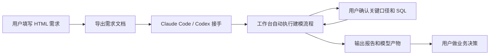

# 风险全场景建模工作台用户使用流程

更新时间：2026-06-09

## 1. 核心原则

这个工作台的使用方式不是让用户自己跑一串复杂命令，而是让用户把建模需求说清楚，后续由 Claude Code / Codex 调用工作台完成建模链路。

用户主要做三件事：

1. 用 HTML 页面填写建模需求。
2. 在关键节点确认业务口径和取数 SQL。
3. 查看模型报告，决定是否继续实验、灰度验证或进入后续上线流程。

Claude Code / Codex 和工作台负责中间的大部分执行工作，包括需求校验、计划生成、run 初始化、样本检查、特征筛选、模型训练、效果评估、历史版本对比、报告生成和交接记录。

## 2. 一句话流程

用户通过 HTML 生成一份建模需求文档，把需求文档交给 Claude Code / Codex；Agent 自动驱动工作台完成建模流程，并在需要人工判断的地方请用户确认，最后交付模型报告、模型卡、管理摘要和完整产物记录。



## 3. 人机分工

| 环节 | 用户负责 | Claude Code / Codex + 工作台负责 |
| --- | --- | --- |
| 需求输入 | 填写建模目标、样本、标签、评估要求 | 检查需求是否完整，转成可执行计划 |
| 样本和口径 | 确认样本范围、标签定义、表现窗口 | 做样本检查，识别异常和缺失项 |
| 数据取数 | 审批 SQL 和关键字段 | 生成 SQL、准备数据、登记产物 |
| 特征处理 | 确认不能使用的字段或穿越风险 | 自动做特征筛选、稳定性检查、重要性筛选 |
| 模型训练 | 确认实验方向 | 训练模型、保存模型和训练证据 |
| 模型评估 | 判断结果是否满足业务目标 | 计算指标、切片评估、历史版本对比 |
| 报告交付 | 阅读结论并决策下一步 | 生成模型报告、模型卡、管理摘要和交接记录 |

## 4. 用户实际怎么用

### 第一步：打开需求生成页面

用户打开本地 HTML 页面：

```bash
open tools/model_request_builder/index.html
```

这个页面相当于建模需求表单。用户不需要写代码，只需要按页面提示填写信息。

### 第二步：填写建模需求

用户重点填写六类信息：

| 类型 | 用户需要说明什么 |
| --- | --- |
| 建模目标 | 要预测什么、排序什么、比较什么，例如逾期风险、复借意愿、营销响应、催收回收等。 |
| 样本范围 | 样本来自哪里，包含哪些用户，排除哪些用户，观察时间是什么。 |
| 标签定义 | 目标变量是什么，表现窗口是什么，正负样本如何定义。 |
| 特征来源 | 使用哪些特征表、宽表或历史特征产物，有哪些字段限制。 |
| 评估要求 | 看哪些指标、哪些月份、哪些客群、是否要和历史模型对比。 |
| 报告要求 | 需要模型报告、模型卡、管理摘要，还是需要补充特定业务切片。 |

填完后，页面会导出一份 Markdown 建模需求文档。后续 Agent 和工作台都以这份文档作为任务契约。

### 第三步：把需求文档交给 Agent

用户把导出的 Markdown 需求文档交给 Claude Code / Codex。

Agent 会自动完成：

- 校验需求文档是否完整。
- 生成执行计划。
- 创建本次建模的独立 run 工作区。
- 按计划调用工作台能力。
- 在遇到缺失信息或需要审批时提醒用户。

用户不需要手工理解每个中间命令，也不需要手工维护 run 状态和产物清单。

### 第四步：用户只确认关键节点

建模过程中，用户通常只需要在少数关键节点做确认：

| 关键节点 | 为什么需要用户确认 |
| --- | --- |
| 样本口径 | 避免训练样本和真实业务目标不一致。 |
| 标签口径 | 避免正负样本定义、表现窗口或风险口径错误。 |
| 取数 SQL | 避免字段、时间范围、过滤条件或数据权限出错。 |
| 特殊字段限制 | 避免使用穿越字段、敏感字段或业务禁止字段。 |
| 历史对比基准 | 确认应该和哪个旧模型、策略分或业务版本比较。 |

除这些需要业务判断的事项外，其余重复性执行工作由 Agent 和工作台完成。

### 第五步：等待工作台自动完成建模链路

用户确认关键口径后，工作台会自动推进：

- 样本检查。
- 特征筛选。
- 数据准备。
- 模型训练。
- 模型评估。
- Champion/Challenger 历史版本对比。
- 模型报告生成。
- 产物登记和审计。
- 交接信息沉淀。

用户不需要手工整理指标、复制表格、拼报告或记录每一步产物位置。

### 第六步：查看交付结果

一次建模完成后，用户主要查看这些结果：

| 交付物 | 用途 |
| --- | --- |
| 模型报告 | 看完整建模过程、核心指标、客群效果、历史版本对比和结论。 |
| 模型卡 | 快速了解模型目标、适用范围、输入输出、效果和限制。 |
| 管理摘要 | 面向管理沟通，快速说明本轮模型是否有价值、风险是什么、下一步做什么。 |
| 缺失项说明 | 明确哪些口径、数据或阶段还没有闭环，避免误用结果。 |
| run 产物记录 | 方便复核、交接、复盘和后续重跑。 |

### 第七步：做业务决策

用户根据报告结论选择下一步：

- 指标达标：进入灰度验证、策略验证或后续上线流程。
- 局部达标：补充分客群实验、特征方案或样本口径。
- 指标不达标：终止本轮方案或调整建模目标。
- 口径未闭环：先补齐样本、标签、SQL 或风险表现定义。

## 5. 为什么更易上手

### 5.1 用户不用写脚本

用户通过 HTML 表单表达需求，不需要手写训练脚本、评估脚本或报告脚本。

### 5.2 用户不用记流程

需求文档生成后，Claude Code / Codex 会根据标准流程推进，工作台负责记录状态和产物。

### 5.3 用户只在关键处介入

用户主要确认业务判断相关内容，例如样本、标签、SQL、风险口径和历史对比基准。重复性的检查、训练、评估和报告整理由工作台自动完成。

### 5.4 结果天然可交接

每次建模都会形成独立 run，保留需求、计划、产物、报告和审计记录。后续换人继续做，也能快速知道当前进度和风险。

## 6. 为什么泛化能力强

工作台把“建模共性流程”和“具体业务口径”分开。

共性流程包括：

- 需求结构化。
- 样本检查。
- 特征筛选。
- 模型训练。
- 模型评估。
- 历史版本对比。
- 报告生成。
- 产物审计。

业务口径放在需求文档和项目配置中，例如：

- 是准入风险、贷中预警、催收回收，还是复借意愿。
- 标签是逾期、违约、发起、响应，还是回款。
- 样本是新户、老户、次新户、流失户，还是某个产品线。
- 对比基准是历史模型、规则分、策略分，还是人工经验分。

因此，同一套工作台可以迁移到多个风险和经营场景，而不是每个场景重新搭一套工具。

## 7. 如何节省人力成本

工作台主要在以下环节节省人力：

| 传统方式 | 使用工作台后 |
| --- | --- |
| 人工反复沟通需求口径 | HTML 需求文档一次结构化记录 |
| 建模人员手写流程脚本 | Agent 调用标准工作台能力 |
| 手工整理样本和特征过程 | 工作台自动登记阶段产物 |
| 手工汇总 AUC、KS、lift、PSI | 工作台统一生成评估结果 |
| 手工复制表格写报告 | 工作台从产物生成报告 |
| 交接靠聊天记录和个人记忆 | run 状态、产物清单和交接文档可追溯 |
| 每个场景重新搭流程 | 一套流程复用到多个风险场景 |

节省的不只是执行时间，还包括沟通成本、复核成本、交接成本和重复开发成本。

## 8. 适用场景

工作台可以服务风险全场景建模，例如：

- 准入风险模型。
- 授信和额度模型。
- 逾期、违约、坏账预测。
- 贷中预警。
- 催收分层和回收预测。
- 反欺诈或异常识别。
- 复借意愿、营销响应、用户召回等风险经营模型。
- 历史模型换版、重训和效果复核。

复借 G 卡只是首个试点，用来验证工作台能否承接真实业务中的复杂样本、多特征、多客群和多版本对比。

## 9. 当前试点说明

当前复借 G 卡试点已经验证了以下能力：

- 支持 960 万级样本评估。
- 支持上万级候选字段筛选。
- 支持约 70 张特征表的特征来源。
- 支持多数据切分、多月份、多客群评估。
- 支持与多个历史 GCard 版本进行 Champion/Challenger 对比。
- 支持生成标准模型报告、模型卡和管理摘要。

需要注意的是，当前复借 G 卡 run 是历史真实产物的标准化导入，不等同于本地端到端重跑。它证明了工作台的产物标准化、评估和报告能力，但后续若要形成完整本地闭环，需要按新 run 重新执行全链路。

## 10. 最简使用清单

用户只需要记住这五步：

1. 打开 HTML 页面填写建模需求。
2. 导出 Markdown 需求文档。
3. 把需求文档交给 Claude Code / Codex。
4. 在样本口径、标签口径和 SQL 等关键节点做确认。
5. 查看模型报告和管理摘要，决定下一步。

中间复杂的建模执行、产物整理、报告生成和交接沉淀，由 Agent 和工作台完成。
