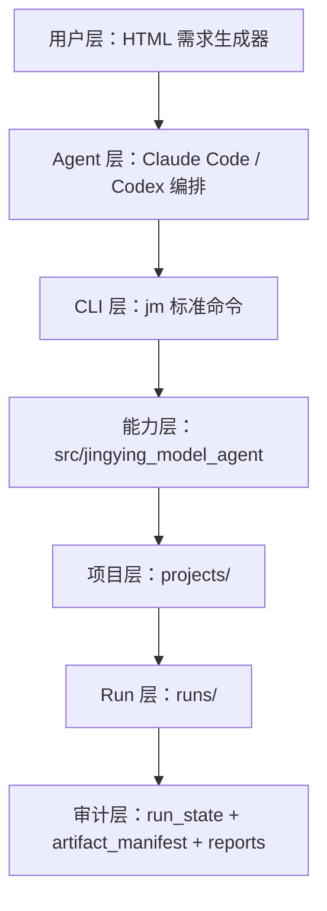

# 风险全场景建模工作台项目架构介绍

更新时间：2026-06-09

## 1. 架构定位

本项目是一个面向风险全场景的本地建模工作台。它通过“可视化需求填写 + Agent 编排 + 标准 CLI + 项目工作区 + 产物审计”的方式，把建模流程从个人脚本沉淀为可复用、可追溯、可交接的团队级能力。

复借 G 卡是当前首个试点项目，用于验证工作台对真实大样本、多特征、多客群、多版本对比场景的承接能力。

## 2. 总体分层



| 层级 | 作用 |
| --- | --- |
| 用户层 | 用 HTML 页面填写建模需求，导出标准 Markdown。 |
| Agent 层 | Claude Code / Codex 读取需求，生成计划，调用工作台执行。 |
| CLI 层 | `jm` 提供稳定命令入口，承接项目、run、样本、特征、训练、评估、报告等动作。 |
| 能力层 | `src/jingying_model_agent/` 封装可复用建模能力。 |
| 项目层 | `projects/<project>/` 保存具体业务口径、配置、请求、文档和运行记录。 |
| Run 层 | 每次建模尝试独立落在 `runs/<run_id>/`，避免覆盖历史结果。 |
| 审计层 | 用状态文件和产物登记证明每个阶段是否真实完成。 |

## 3. 主要目录结构

```text
jingying_model_agent/
├── tools/model_request_builder/        # 可视化建模需求填写页面
├── src/jingying_model_agent/           # 工作台核心能力代码
├── workflows/                          # 标准建模工作流定义
├── templates/project/                  # 新项目模板
├── schemas/                            # 需求文档和执行计划结构约束
├── docs/                               # 工作台级说明文档
├── tests/                              # 自动化测试
├── vendor/feature-select-v2/           # 特征筛选算法依赖，作为只读外部实现
└── projects/                           # 具体建模项目工作区
```

当前试点项目结构：

```text
projects/2026-05-fujie-gcard-v1/
├── project.yml                         # 项目基础配置和业务口径
├── project_state.yml                   # 项目级断点和连续性状态
├── configs/                            # 训练、评估、样本、特征、报告配置
├── requests/                           # 用户导出的建模需求和执行计划
├── docs/                               # 项目文档、名词口径、功能介绍、使用流程
├── data/                               # 本地数据、样本、profile 和缓存目录
├── queries/                            # SQL 模板或生成 SQL
├── runs/                               # 每次建模运行的独立工作区
├── handoffs/                           # 会话交接记录
└── retrospectives/                     # 阶段复盘记录
```

## 4. 一次建模 Run 的结构

每次建模都会创建一个独立 `run_id`，并在 `runs/<run_id>/` 下保存全链路证据。

典型 run 结构：

```text
runs/<run_id>/
├── run_state.yml                       # run 阶段状态和断点信息
├── audit/
│   ├── artifact_manifest.json          # 已登记产物清单和来源
│   ├── command_log.jsonl               # 命令执行记录
│   └── decision_log.md                 # 关键决策记录
├── sample_check/                       # 样本检查结果
├── feature_selection/                  # 特征筛选结果
├── modeling_input/                     # 入模数据配置和字段快照
├── modeling/                           # 模型文件、指标、特征重要性
├── evaluation/                         # 评估、分箱、PSI、版本对比结果
└── reports/                            # 模型报告、模型卡、管理摘要
```

这套结构的核心价值是：每次模型产物都能追溯到对应的样本、特征、训练配置、评估结果和报告来源。

## 5. 工作台核心能力

### 5.1 可视化需求填写

`tools/model_request_builder/index.html` 是用户入口。用户通过页面填写建模目标、样本、标签、特征、实验、评估和报告要求，导出 Markdown 需求文档。

这降低了使用门槛，让非工程用户也能用结构化方式提交建模需求。

### 5.2 需求驱动执行

需求文档会被工作台校验，并转换成执行计划。Claude Code / Codex 根据执行计划调用 `jm` 命令推进任务，避免靠人工记忆执行步骤。

核心流程是：

```text
HTML 填写需求 -> 导出 Markdown -> 校验需求 -> 生成计划 -> 初始化 run -> 执行建模流程 -> 输出报告
```

### 5.3 标准 CLI

`jm` 是工作台的统一入口，覆盖：

- 项目初始化和校验。
- 需求校验和计划生成。
- run 创建、状态查看和审计。
- 样本检查。
- 特征元数据和特征筛选。
- 宽表 SQL 生成。
- 模型训练。
- 模型评估。
- Champion/Challenger 对比。
- 报告生成。
- 交接、复盘和经验沉淀。

CLI 的作用是把建模动作标准化，减少临时脚本和手工整理。

### 5.4 断点续跑和重试

工作台通过 `project_state.yml`、`run_state.yml` 和 `artifact_manifest.json` 支持断点续跑。

- `project_state.yml` 记录当前 active run、当前目标、下一步动作和风险。
- `run_state.yml` 记录每个阶段是 `done`、`pending`、`imported` 还是 scaffold。
- `artifact_manifest.json` 记录每个产物的路径、来源、阶段和校验信息。

当任务中断或失败时，Claude Code / Codex 可以根据这些文件判断：

- 哪些阶段已经完成。
- 哪些阶段仍未完成。
- 哪些产物是真实结果。
- 哪些产物只是 scaffold 或 imported evidence。
- 应该从哪个阶段继续或重试。

这使工作台适合长周期建模任务，不需要每次从头开始。

### 5.5 SQL 审批和数据安全门禁

涉及 DP 或 `TMLSQLClient` 取数时，工作台先生成 dry-run SQL 给用户确认。只有人工确认后，才允许执行真实取数。

这个机制用于降低错误拉数、口径误用和数据安全风险。

### 5.6 样本、特征、训练、评估闭环

工作台已经沉淀了建模主链路能力：

- 样本检查：样本规模、标签分布、切分分布、客群分布。
- 特征筛选：元数据、缺失率、稳定性、相关性、随机重要性、空标签重要性。
- 模型训练：标准二分类训练、特征重要性、模型文件和训练配置快照。
- 模型评估：AUC、KS、PSI、decile lift、月度效果、客群效果。
- 版本对比：新模型与历史模型或策略分的 Champion/Challenger 对比。
- 报告生成：模型报告、模型卡、管理摘要和缺失项说明。

### 5.7 产物审计和交接

工作台不会只看目录里是否有文件，而是要求关键产物登记到 manifest。报告也应基于已登记产物生成。

同时，工作台支持写入：

- handoff：说明当前进度、风险和下一步。
- retrospective：记录阶段复盘。
- lessons：沉淀可复用经验，后续可提升为 CLI guardrail、测试或 Agent skill。

## 6. 架构优势

| 优势 | 说明 |
| --- | --- |
| 易上手 | 用户通过 HTML 填写需求，不需要理解底层命令。 |
| 泛化强 | 业务口径放在项目配置和需求文档中，共性能力沉淀在工作台中。 |
| 可追溯 | 每次 run 都有状态、产物、命令和决策记录。 |
| 可续跑 | 中断后可基于 run 状态和 manifest 定位断点继续。 |
| 可审计 | 区分真实产物、导入产物和 scaffold，避免误把占位结果当成模型证据。 |
| 省人力 | 减少重复脚本、手工汇总、报告拼接和交接沟通成本。 |
| 可扩展 | 新场景可复用模板、workflow、CLI 和核心模块。 |

## 7. 当前试点状态说明

当前 active run 是 `2026-06-imported-gcard-main-lgbm`，它是复借 G 卡真实历史训练、评估和报告产物的标准化导入。

它已经验证了工作台对真实项目产物标准化、评估对比和报告生成的承接能力；但它不是本地端到端重跑证据。后续如果要证明完整本地闭环，应创建新的 run 并按标准流程执行样本、特征、训练、评估和报告全链路。
